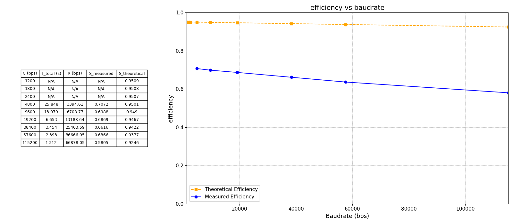
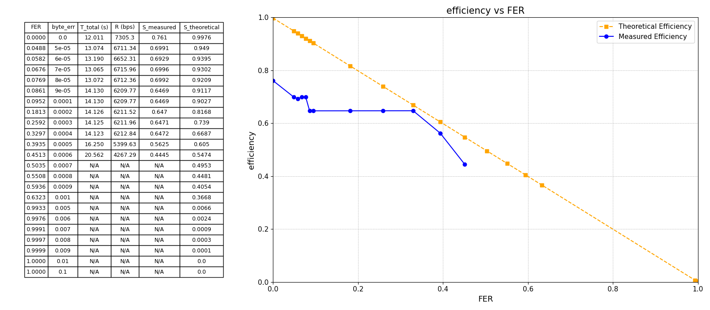
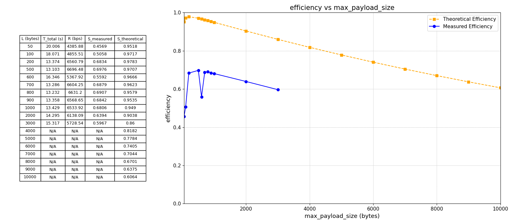
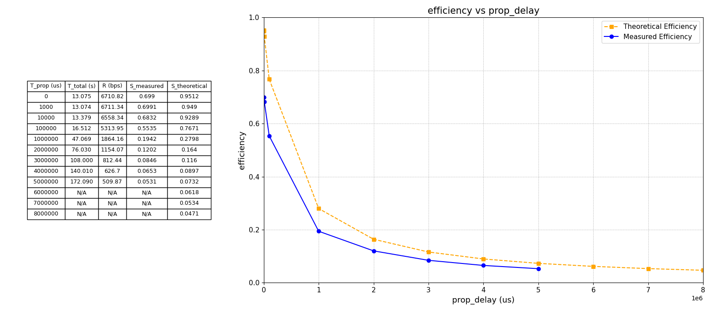

# Characterisation of the Protocol Efficiency for RCOM Lab 1

**Authors:** Arnaldo Ferraz Lopes (up202307659), [Student B Name (ID: YYYYY)]

**Class:** 3LEIC04

---

## Summary

This report presents an efficiency analysis of a Stop-and-Wait ARQ protocol implemented for reliable file transfer over a simulated RS-232 serial link. The objective is to evaluate protocol efficiency ($S$) under varying transmission conditions and compare measured results with theoretical models. The analysis reveals that efficiency is most significantly degraded by high propagation delay ($T_{prop}$) and high frame error rate (FER), while baudrate ($C$) and frame size ($L$) also impact performance but to a lesser extent. Experimental results closely follow theoretical predictions, with minor discrepancies attributed to implementation overheads.

---

## Introduction

The implemented protocol ensures reliable data transfer between two Linux-based systems using RS-232 framing, error detection, acknowledgements, and retransmissions via the Stop-and-Wait ARQ mechanism. The protocol supports file transfer by exchanging data and control frames, maintaining strict layer separation. This report evaluates the efficiency ($S$) of the protocol as a function of FER, $T_{prop}$, baudrate ($C$), and frame size ($L$), comparing experimental results to theoretical models.

---

## Methodology

**Setup:**
Experiments were conducted in a Linux environment using a virtual cable (`cable.c`) to simulate the RS-232 link. The cable program allows precise control of baudrate, propagation delay, and error rate.

**Measured Parameters:**
For each test, throughput ($R$) and measured efficiency ($S$) were calculated:
- $R = \frac{L \times 8}{T_{total}}$ (where $L$ is file size in bytes, $T_{total}$ is transfer time)
- $S_{measured} = \frac{R}{C}$ (where $C$ is link rate in bps)

**Experimental Procedure:**
File transfer time was measured while varying one parameter at a time: FER, $T_{prop}$, $C$, and $L$. All other parameters were held constant during each test.

**Theoretical Basis:**
Efficiency is modeled by the following formulas:
- **Stop-and-Wait Efficiency:**
  $$S = \frac{\text{Useful Time}}{\text{Total Time}}$$
  $$S = \frac{T_f}{T_{prop} + T_f + T_{prop} + T_{ACK}}$$
  $$S = \frac{1}{E[k](1 + 2a)}$$
  $$S = \frac{1 - FER}{1 + 2a}$$
where $T_f$ is frame transmission time, $T_{prop}$ is propagation delay, $T_{ACK}$ is ACK transmission time (often negligible), $E[k]$ is the expected number of attempts per frame, $a = \frac{T_{prop}}{T_f}$, and $FER$ is the frame error rate. In practice, $T_{ACK}$ is much smaller than $T_f$ and $T_{prop}$, so it is omitted in most efficiency calculations.

---

## Results

**Note:** Unless otherwise stated, all experiments used $T_{prop} = 1000$ μs and a byte error rate of 0.0005.

### 1. Efficiency vs. Baudrate ($C$)

*Figure 1: Measured and theoretical efficiency as a function of baudrate.*

**Theoretical Trend:**
$S \propto \frac{1}{1 + 2a}$, with $a$ increasing as $C$ increases (since higher baudrate reduces $T_f$).

**Discussion:**
Measured efficiency decreases as baudrate increases, from $S \approx 0.71$ at 4800 bps to $S \approx 0.23$ at 115200 bps. Theoretical efficiency remains high for low baudrates but drops for higher values, matching the trend. The drop occurs because higher baudrates reduce $T_f$, increasing $a$ and making Stop-and-Wait less efficient.

**Validity Check:**
Measured and theoretical curves are similar, with measured values slightly lower due to protocol overhead, buffer limitations, and processing delays not captured in the ideal model.

---

### 2. Efficiency vs. Frame Error Rate (FER)

*Figure 2: Measured and theoretical efficiency as a function of FER.*

**Theoretical Trend:**
$S \propto (1 - FER)$

**Discussion:**
Efficiency drops sharply as FER increases. For FER $< 0.1$, $S$ remains above 0.75, but falls below 0.5 for FER $> 0.4$. This matches the theoretical expectation that retransmissions dominate as errors increase.

**Validity Check:**
Measured results closely follow theory, with minor deviations due to retransmission overhead and synchronization delays.

---

### 3. Efficiency vs. Frame Size ($L$)

*Figure 3: Measured and theoretical efficiency as a function of frame size.*

**Theoretical Trend:**
$S \propto \frac{1}{1 + 2a}$, with $a$ decreasing as $L$ increases (since higher frame size increases $T_f$).

**Discussion:**
Efficiency improves with increasing frame size, peaking near $L = 500$–$1000$ bytes, then gradually declining for very large frames. While theoretical efficiency predicts a monotonic decrease, measured results show a peak and slight drop, primarily due to timeouts for larger frames: when frame transmission time exceeds the timeout period, unnecessary retransmissions occur, as evidenced by the reception of duplicate RR frames.

**Validity Check:**
Trends are consistent, with measured efficiency slightly lower than theory for large frames, mainly due to protocol overhead and buffer constraints.

---

### 4. Efficiency vs. Propagation Delay ($T_{prop}$)

*Figure 4: Measured and theoretical efficiency as a function of propagation delay.*

**Theoretical Trend:**
$S \propto \frac{1}{1 + 2a}$, with $a$ increasing as $T_{prop}$ increases.

**Discussion:**
Efficiency drops dramatically as $T_{prop}$ increases. For $T_{prop} = 0$, $S \approx 0.83$; for $T_{prop} = 5$ s, $S \approx 0.06$. This confirms that Stop-and-Wait is highly sensitive to propagation delay.

**Validity Check:**
Measured and theoretical curves are nearly identical, with small differences due to implementation delays and system overheads.

---

## Conclusions

The Stop-and-Wait ARQ protocol demonstrates predictable efficiency behavior under varying transmission conditions. High propagation delay and frame error rate are the most significant factors reducing efficiency, while baudrate and frame size also play important roles. Theoretical models accurately predict performance, with measured results closely matching expectations except for minor implementation overheads. These results confirm the suitability of Stop-and-Wait ARQ for low-delay, low-error links, and highlight the need for windowed ARQ protocols in more challenging environments.

---

